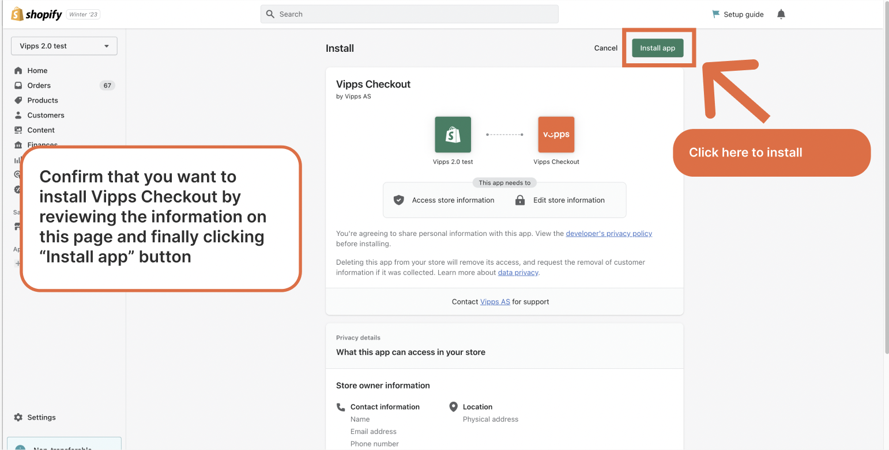
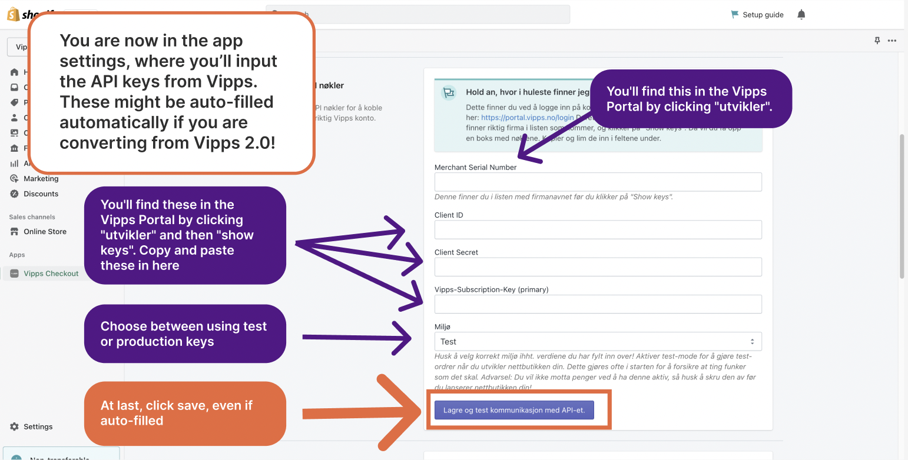
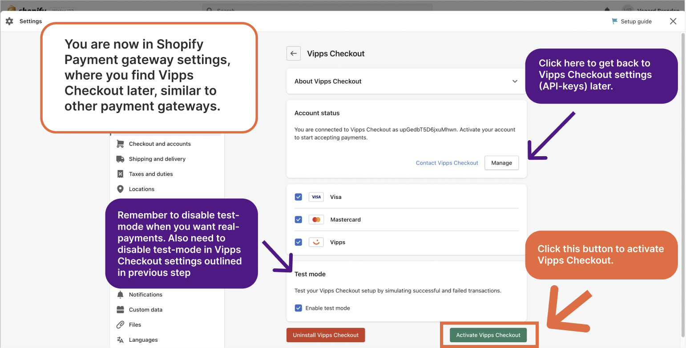
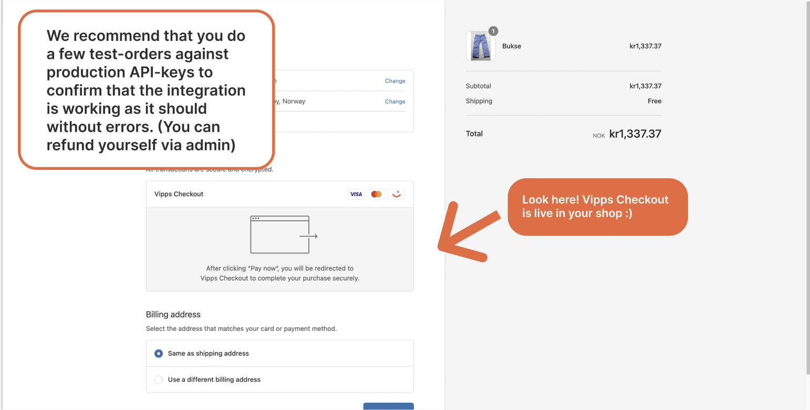

# Vipps/MobilePay Checkout for Shopify

  *Available for Vipps and MobilePay.*

*This plugin is built and maintained by [Crude](https://crude.no/) and hosted on the [Shopify app store](https://apps.shopify.com/vipps-checkout).*

Enable customers to choose Vipps or MobilePay as a payment method directly in the checkout.

Download the plugin from the [Shopify app store](https://apps.shopify.com/vipps-checkout).

To add branding and order information, install the [Companion plugin](/docs/plugins-ext/shopify-companion/).

## Description

This is the official *Vipps/MobilePay Checkout* plugin for Shopify.

Branded locally as MobilePay in Denmark and Finland, and as Vipps in Norway. One platform gathering more than 11 million users and more than 400,000 merchants across the Nordics. Give your users an easy, fast and familiar shopping experience.

Increase your conversion rate by letting your customers pay with a fast, secure and convenient payment method. Vipps MobilePay allows users to make quick and easy payments using their mobile phone, without the need for entering credit card details or other sensitive information.

You can also do important back office tasks such as capture and refund directly from Shopify. Easy for your customer and easy for you.

## Vipps for Shopify vs Vipps/MobilePay Checkout? What's the difference?

For the moment, there are two payment methods offered from Vipps MobilePay available in Shopify:  *Vipps/MobilePay Checkout* (this plugin) and [*Vipps for Shopify*](/docs/plugins-ext/shopify/) (also called *Vipps 2.0 for Shopify*). *Vipps for Shopify* will be depreciated and replaced completely by Vipps Checkout in the future, so we suggest installing Vipps Checkout right away.

## Payment

When you enable this plugin, your customers will be able to choose Vipps or MobilePay as a payment method directly in the checkout. There is no need to go via a third party payment method. If your customer chooses Vipps, they fill in the contact information and their phone number before confirming to pay in the Vipps app. The order is then completed and are stored in your Shopify store.

**Please note:** Vipps does not have a solution for *Express Checkout* in Shopify.
This is due to limitations on Shopify's side, and if Shopify makes changes that
make *Express Checkout* possible, we will add this functionality.

## How to get started

- Sign up to use [*Checkout*](https://vippsmobilepay.com/online/checkout).
- After 1-2 days, you will get an email with login details to Vipps MobilePay Merchant Portal, [portal.vippsmobilepay.com](https://portal.vippsmobilepay.com/), where you can get the API credentials.
- Download and configure.

See [Logging in to the portal](/docs/knowledge-base/portal#how-to-log-in).

## How to get account keys from the merchant portal

1. Sign in to [portal.vippsmobilepay.com](https://portal.vippsmobilepay.com/).
2. In the *For Developers* section, choose *Production* keys. Here, you can find the merchant serial number (6-7 figures).
3. Under the *API keys* column, select *Show keys* to see *Client ID*, *Client Secret*, and *Ocp-Apim-Subscription-Key*.

See:

- [Logging in to the portal](/docs/knowledge-base/portal#how-to-log-in)
- [How to find the API keys](/docs/knowledge-base/portal#how-to-find-the-api-keys).

## Installation

### Step 1 - Preparations

Make sure you have easy access to the API keys, by logging in to the [Merchant Portal](https://portal.vippsmobilepay.com/) and find the correct API keys.

**Pro-tip**: If you are migrating from the old Vipps gateway (called *Vipps 2.0 in Shopify*), *don't uninstall it yet*, as we can autofill the API keys for you if it's installed. Makes it way easier for you to migrate. :)

### Step 2 - Install Checkout app

Go to the [Shopify App store](https://apps.shopify.com/vipps-checkout?locale=nb) and install the *Vipps/MobilePay Checkout* app.

### Step 3 - Confirm and install

Confirm that you want to install *Checkout* by reviewing the information on the page and clicking the *Install app* button.

### Step 4 - Input API keys

Go to the app settings. Input the API keys from Vipps MobilePay.
These may be autofilled if you are converting from Vipps 2.0.

### Step 5 - Activate Checkout

In the *Shopify Payment Gateway* settings, activate *Vipps/MobilePay Checkout*.

### Step 6 - Test

Do a few test orders against the production API keys to confirm that the integration is working without errors.

### Step 7 - Clean up

If you were migrating from an older plugin version, you can safely remove it from Shopify now.

## Add branding to your store

To add Vipps or MobilePay logos and icons to your store, get the [Vipps/MobilePay Shopify Companion plugin](/docs/plugins-ext/shopify-companion/).

## What do the different order statuses mean?

See [Shopify Order statuses with Vipps MobilePay](/docs/plugins-ext/shopify/shopify-faq/#what-do-the-different-order-statuses-in-shopify-mean-when-combined-with-vipps-mobilepay) for information regarding order statuses.

## How can I get help if I have any issues?

For issues with plugin installation, contact us via our [support system](https://vipps-shopify.atlassian.net/servicedesk/customer/portal/3).

## FAQ

- [Shopify FAQ](/docs/plugins-ext/shopify/shopify-faq/)
- [Knowledge base](/docs/knowledge-base/)